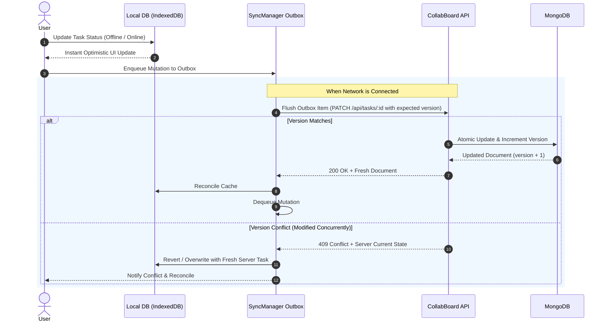

# 🚀 CollabBoard

> A high-performance, enterprise-grade collaborative Kanban board and sprint planning platform built with **Node.js**, **Express**, **MongoDB / Mongoose**, **React 19**, **TypeScript**, **Tailwind CSS v4**, and **PouchDB / IndexedDB** local-first sync.

---

## 🌟 Key Features

- 🏢 **Multi-Tenant Workspaces**: Organize projects into isolated team workspaces (e.g., *Core Engineering*, *Product & Design*) with workspace-level avatar theming and dynamic role-based access control (**Owner**, **Admin**, **Member**).
- 📋 **Agile Kanban Boards**: Interactive board columns (`To Do`, `In Progress`, `Done`), fluid drag-and-drop simulation, priority badges (`urgent`, `high`, `medium`, `normal`, `low`), custom tags, and due-date tracking.
- ⚡ **Local-First & Offline Outbox Sync**:
  - Client-side persistence powered by **PouchDB** for near-instant reads and offline resilience.
  - Offline mutation outbox queue capturing creations, updates, and status transitions when disconnected.
  - Background synchronization manager (`SyncManager`) that auto-flushes queued changes FIFO upon network reconnection or visibility restoration.
  - Real-time online/offline status indicators and Stale-While-Revalidate (SWR) cache revalidation.
- 🔄 **Optimistic Concurrency Control (OCC)**:
  - Document-level integer `version` tracking on tasks to detect concurrent edit collisions.
  - Automatic `409 Conflict` detection and safe rejection on stale updates to prevent data loss.
- 💬 **Task Collaboration & Comments**: Sub-resource discussion threads on tasks with author tracking and real-time UI updates.
- 🔐 **Defensive Security & Authentication**:
  - Stateless Bearer JWT authentication, bcrypt password hashing, and client-side protected route guards.
  - Sliding-window IP rate limiting on authentication and sensitive endpoints.
  - Strict input validation middleware across body, params, and query strings powered by **Zod**.
  - Security headers and origin-validated CORS configuration.
- 📊 **Dynamic Analytics & Metrics**: Real-time workspace statistics and board analytics tracking active boards, tasks in flight, completion rates, and collaborator sets.
- 📖 **Interactive Swagger / OpenAPI Docs**: Interactive API playground and OpenAPI 3.0 contract specification at `/api/docs` and `/api/docs.json`.
- 🧪 **Enterprise Test Automation & CI/CD**:
  - Backend: 6 test suites (52 tests) using **Jest**, **Supertest**, and **mongodb-memory-server**.
  - Frontend: Component and unit test suites using **Vitest**, **React Testing Library**, and **JSDOM**.
  - High-speed linting via **Oxlint**.
  - Continuous Integration pipeline running automated testing and coverage uploads via **GitHub Actions**.

---

## 🏛️ System Architecture

CollabBoard implements a layered, local-first architecture designed for responsiveness and reliability:

```
┌────────────────────────────────────────────────────────────────────────┐
│                        Client Layer (React 19)                         │
│  ┌─────────────────────────┐            ┌───────────────────────────┐  │
│  │   UI Components & Views │            │  SyncManager (Outbox Q)   │  │
│  └────────────┬────────────┘            └─────────────┬─────────────┘  │
│               │ (SWR Cache Reads)                     │                │
│  ┌────────────▼───────────────────────────────────────▼─────────────┐  │
│  │               Local Persistence (PouchDB / IndexedDB)            │  │
│  └──────────────────────────────────┬───────────────────────────────┘  │
└─────────────────────────────────────┼──────────────────────────────────┘
                                      │ HTTP / JSON (Bearer JWT)
┌─────────────────────────────────────▼──────────────────────────────────┐
│                   CollabBoard Server (Node.js & Express)               │
│  ┌──────────────────────────────────────────────────────────────────┐  │
│  │ 1. Routes & Middleware  (JWT Auth, Zod Validation, Rate Limiter) │  │
│  ├──────────────────────────────────────────────────────────────────┤  │
│  │ 2. Controllers Layer   (HTTP parameter parsing & response codes) │  │
│  ├──────────────────────────────────────────────────────────────────┤  │
│  │ 3. Services Layer      (Business rules, RBAC checks, OCC logic)  │  │
│  ├──────────────────────────────────────────────────────────────────┤  │
│  │ 4. Repositories Layer  (Mongoose models, atomic updates & queries│  │
│  └──────────────────────────────────┬───────────────────────────────┘  │
└─────────────────────────────────────┼──────────────────────────────────┘
                                      ▼
                        ┌───────────────────────────┐
                        │   MongoDB Document Store  │
                        └───────────────────────────┘
```

### Offline Synchronization & OCC Flow



---

## 🗄️ Database & Data Model Decisions

### Embed vs. Reference Strategy

| Entity / Relationship | Storage Pattern | Architecture Justification |
| :--- | :--- | :--- |
| **Columns inside Board** | **Embed** | Bounded array (3–7 columns per board), loaded together to render board views, and updated atomically. |
| **Members inside Board** | **Embed** | Bounded collaborator array (`[{ userId, role }]`), loaded with board document for zero-latency permission checks. |
| **Tasks** | **Reference (Collection)** | Unbounded growth (can scale to thousands per board), queried independently (assignee filters, due-date queries), and updated frequently. Embedding would risk 16MB document limits and cause lock contention. |
| **Users** | **Reference (Collection)** | Shared globally across workspaces and boards. Referencing prevents stale duplicate user profiles. |
| **Comments** | **Reference (Collection)** | Unbounded append-only discussion logs. Stored in a separate collection to keep parent task documents lightweight. |

---

## 📋 CollabBoard REST API Contract

All private endpoints require an `Authorization: Bearer <token>` header.

### 1. Authentication
| Method | Endpoint | Description | Request Body | Response |
| :--- | :--- | :--- | :--- | :--- |
| **POST** | `/api/auth/register` | Register new user account | `{ name?, email, password }` | `201 Created` |
| **POST** | `/api/auth/login` | Authenticate & obtain JWT | `{ email, password }` | `200 OK` |
| **POST** | `/api/auth/logout` | Revoke session / clear cookie | *None* | `200 OK` |
| **GET** | `/api/auth/me` | Fetch authenticated user profile | *None* | `200 OK` |

### 2. Workspaces
| Method | Endpoint | Description | Request Body | Response |
| :--- | :--- | :--- | :--- | :--- |
| **GET** | `/api/workspaces` | List accessible workspaces with stats | *None* | `200 OK` |
| **POST** | `/api/workspaces` | Create a new workspace | `{ name, description?, color? }` | `201 Created` |
| **GET** | `/api/workspaces/:id` | Get single workspace & member roster | *None* | `200 OK` |
| **PATCH** | `/api/workspaces/:id` | Update workspace details or members | `{ name?, description?, color?, admins?, members? }` | `200 OK` |
| **DELETE**| `/api/workspaces/:id` | Delete workspace *(Owner only)* | *None* | `204 No Content` |

### 3. Boards & Analytics
| Method | Endpoint | Description | Request Body | Response |
| :--- | :--- | :--- | :--- | :--- |
| **GET** | `/api/boards` | List accessible sprint boards | *None* | `200 OK` |
| **POST** | `/api/boards` | Create a board in a workspace | `{ title, description?, workspaceId, color?, icon?, tags? }` | `201 Created` |
| **GET** | `/api/boards/:id` | Get board details & column layout | *None* | `200 OK` |
| **GET** | `/api/boards/:id/analytics` | Get board task metrics & completion rates | *None* | `200 OK` |
| **PATCH** | `/api/boards/:id` | Update board title, tags, or favorite status | `{ title?, description?, isFavorite?, tags? }` | `200 OK` |
| **DELETE**| `/api/boards/:id` | Delete a board *(Owner only)* | *None* | `204 No Content` |
| **POST** | `/api/boards/:id/members` | Add a collaborator to board | `{ userId, role? }` | `200 OK` |
| **DELETE**| `/api/boards/:id/members/:memberId` | Remove board collaborator | *None* | `200 OK` |

### 4. Tasks, Lifecycle & Comments
| Method | Endpoint | Description | Request Body / Query | Response |
| :--- | :--- | :--- | :--- | :--- |
| **GET** | `/api/boards/:id/tasks` | Get tasks for a board (filterable) | `?status=&assignee=&priority=&search=&page=&limit=` | `200 OK` |
| **GET** | `/api/tasks` | Global tasks list across all boards | `?boardId=&status=&assignee=&priority=&page=&limit=` | `200 OK` |
| **POST** | `/api/tasks` | Create a new task | `{ title, boardId, description?, status?, priority?, assignee?, dueDate?, tags? }` | `201 Created` |
| **GET** | `/api/tasks/:id` | Get task details by ID | *None* | `200 OK` |
| **PATCH** | `/api/tasks/:id/status`| Update status (OCC verified) | `{ status }` | `200 OK` |
| **PATCH** | `/api/tasks/:id` | Update task fields (with `version` OCC) | `{ title?, description?, status?, priority?, assignee?, dueDate?, tags?, version? }` | `200 OK` *(or `409 Conflict`)* |
| **DELETE**| `/api/tasks/:id` | Remove a task | *None* | `204 No Content` |
| **GET** | `/api/tasks/:id/comments` | List discussion comments for task | *None* | `200 OK` |
| **POST** | `/api/tasks/:id/comments` | Post a comment to task thread | `{ content }` | `201 Created` |
| **DELETE**| `/api/tasks/:id/comments/:commentId` | Delete a comment | *None* | `204 No Content` |

### 5. System Health & Documentation
| Method | Endpoint | Description | Response |
| :--- | :--- | :--- | :--- |
| **GET** | `/api/health` | Service health, DB readyState & uptime | `200 OK` |
| **GET** | `/api/docs` | Interactive Swagger UI Explorer | `200 OK` |
| **GET** | `/api/docs.json` | OpenAPI 3.0 Contract Specification | `200 OK` |

---

## 📦 Standard API Response Envelopes

### Success Envelope (Single Resource)
```json
{
  "data": {
    "id": "66f123456789abcdef012345",
    "title": "Implement OCC versioning",
    "status": "in-progress",
    "priority": "high",
    "version": 2
  }
}
```

### Collection Envelope (Paginated)
```json
{
  "data": [ ... ],
  "meta": {
    "page": 1,
    "limit": 20,
    "total": 42
  }
}
```

### Conflict Error Envelope (HTTP 409)
```json
{
  "error": {
    "message": "Task was modified by someone else",
    "code": "CONFLICT_ERROR",
    "requestId": "req-9a8b7c6d",
    "details": {
      "yourVersion": 1,
      "current": {
        "id": "66f123456789abcdef012345",
        "version": 2,
        "status": "done"
      }
    }
  }
}
```

---

## 🛠️ Tech Stack

### Frontend
- **Framework & Tooling:** React 19, TypeScript, Vite 8
- **Styling & Design:** Tailwind CSS v4, Glassmorphism aesthetic, Lucide React icons
- **State & Routing:** React Router v7 (with Protected Route guards), React Context
- **Local Persistence & Sync:** PouchDB (IndexedDB adapter), custom FIFO SyncManager outbox queue
- **Testing & Quality:** Vitest, React Testing Library, JSDOM, Oxlint

### Backend
- **Runtime & Framework:** Node.js (ES Modules), Express 4
- **Database & ODM:** MongoDB, Mongoose 9
- **Validation Engine:** Zod Schema Validation middleware
- **Security & Rate Limiting:** JSON Web Tokens (JWT), Bcrypt.js, Custom Sliding-Window Rate Limiter
- **Documentation:** Swagger UI Express, OpenAPI 3.0 YAML specification
- **Testing & Quality:** Jest, Supertest, MongoDB Memory Server (`mongodb-memory-server`)

### Infrastructure & CI/CD
- **Continuous Integration:** GitHub Actions (`.github/workflows/ci.yml`)
- **Matrix Checks:** Node 22 runtime, full backend test suite, client linting, and frontend test runner

---

## ⚙️ Environment Variables

Configure backend environment variables in `Backend/.env` (refer to `Backend/.env.example`):

| Variable | Description | Default / Example |
| :--- | :--- | :--- |
| `PORT` | HTTP server listening port | `4000` |
| `JWT_SECRET` | Cryptographic secret for signing JWT access tokens | `your-secure-jwt-secret` |
| `CLIENT_ORIGIN` | Allowed client CORS origin URL | `http://localhost:5173` |
| `MONGODB_URI` | Connection URI for MongoDB document database | `mongodb://localhost:27017/collabboard` |

---

## 📁 Repository Structure

```
CollabBoard/
├── .github/
│   └── workflows/
│       └── ci.yml                 # Automated CI test & coverage pipeline
├── docs/
│   └── openapi.yaml               # OpenAPI 3.0 API specification
├── Backend/
│   ├── src/
│   │   ├── controllers/           # HTTP controllers for all domain entities
│   │   ├── middleware/            # Auth, Zod validation, rate limiter, error handlers
│   │   ├── models/                # Mongoose schemas (Workspace, Board, Task, Comment, User)
│   │   ├── repos/                 # Data access repository layer
│   │   ├── routes/                # Express routing definitions
│   │   ├── schemas/               # Zod validation rules
│   │   ├── services/              # Business logic, RBAC, and OCC enforcement
│   │   ├── app.js                 # Express application configuration
│   │   └── server.js              # Server bootstrapper & DB connection
│   └── tests/                     # Jest & Supertest integration test suites
├── Frontend/
│   ├── src/
│   │   ├── api/                   # HTTP client endpoints
│   │   ├── components/            # UI components (Kanban board, columns, cards, modals)
│   │   ├── context/               # AuthContext, BoardContext, WorkspaceContext
│   │   ├── db/                    # PouchDB IndexedDB local storage adapter
│   │   ├── sync/                  # SyncManager mutation outbox queue
│   │   ├── pages/                 # Dashboard, BoardView, TaskDetails, Login, Register
│   │   └── setupTests.ts          # Vitest testing setup configuration
│   └── vite.config.ts             # Vite configuration with Tailwind & Vitest setup
└── package.json                   # Root orchestrator scripts
```

---

## 🚀 Getting Started

### 1. Prerequisites
- **Node.js** >= v18.0.0 (Node.js v20+ recommended)
- **npm** >= v9.0.0
- **MongoDB** running locally or a MongoDB Atlas connection URI

---

### 2. Quick Start from Root

You can run both backend and frontend directly using the root `package.json` convenience scripts:

```bash
# Clone the repository
git clone https://github.com/5h3ld0rr/CollabBoard.git
cd CollabBoard

# Start backend server (http://localhost:4000)
npm run dev:backend

# In a separate terminal, start frontend dev server (http://localhost:5173)
npm run dev:frontend
```

---

### 3. Manual Step-by-Step Setup

#### Backend Setup
```bash
# 1. Navigate to the backend directory
cd Backend

# 2. Install dependencies
npm install

# 3. Configure environment
cp .env.example .env
# Update .env with your MONGODB_URI and JWT_SECRET if required

# 4. Start the development server
npm run dev
```
- **Backend API**: `http://localhost:4000`
- **Swagger Documentation**: `http://localhost:4000/api/docs`
- **Health Check**: `http://localhost:4000/api/health`

#### Frontend Setup
```bash
# 1. Navigate to the frontend directory
cd Frontend

# 2. Install dependencies
npm install

# 3. Start the Vite development server
npm run dev
```
- **Frontend App**: `http://localhost:5173`

---

## 🧪 Testing & Code Quality

Both backend and frontend feature automated test suites and linters.

### Backend Tests (Jest & Supertest)
```bash
cd Backend

# Run all test suites
npm test

# Run tests in watch mode
npm run test:watch

# Run test coverage report
npm run test:coverage
```

### Frontend Tests & Linting (Vitest & Oxlint)
```bash
cd Frontend

# Run unit and component test suites
npm test

# Run tests in watch mode
npm run test:watch

# Run test coverage report
npm run test:coverage

# Run linter
npm run lint
```

---
