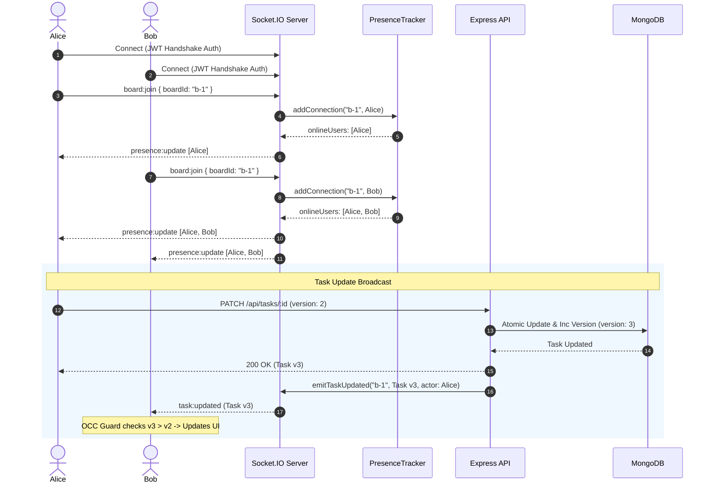
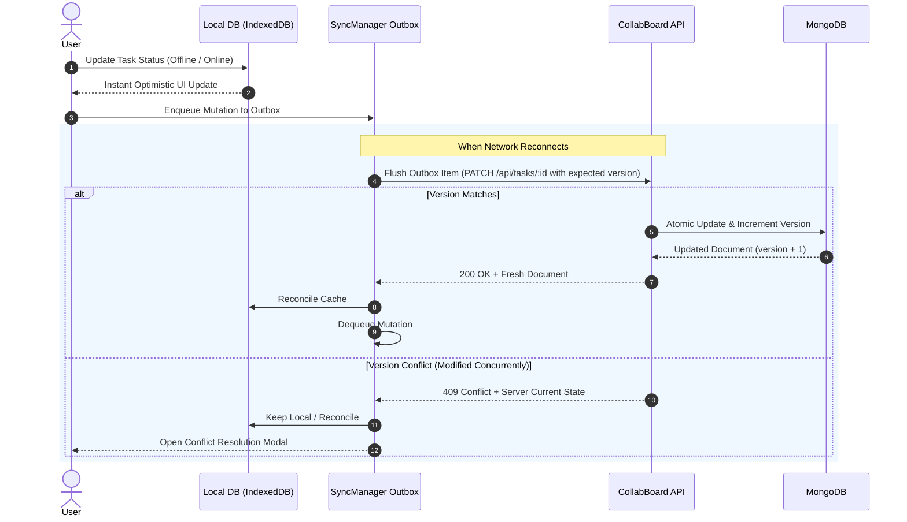

# 🚀 CollabBoard

[](https://collabboard.darklin3.xyz)
[](https://collabboard.darklin3.xyz/api/docs)
[](https://collabboard.darklin3.xyz)

> A high-performance, enterprise-grade collaborative Kanban board and sprint planning platform built with **Node.js**, **Express**, **MongoDB / Mongoose**, **Socket.IO**, **React 19**, **TypeScript**, **Tailwind CSS v4**, and **PouchDB / IndexedDB** local-first sync.
>
> 🌐 **Live Application:** [https://collabboard.darklin3.xyz](https://collabboard.darklin3.xyz)  
> 📖 **Interactive API Docs:** [https://collabboard.darklin3.xyz/api/docs](https://collabboard.darklin3.xyz/api/docs)  
> 🩺 **Service Health:** [https://collabboard.darklin3.xyz/api/health](https://collabboard.darklin3.xyz/api/health)

---

## 🌟 Key Features

- 🏢 **Multi-Tenant Workspaces**:
  - Organize projects into isolated team workspaces with workspace-level avatar/color theming and role-based access control (**Owner**, **Admin**, **Member**).
  - Strict per-owner workspace isolation with membership authorization checks.
  - Workspace board counts accurately tracking both owned boards and shared collaborator boards with visual badges.
  - Subscription plan tier limits enforced across workspaces, boards, and team members (**Free**, **Pro**, **Enterprise**).

- 📋 **Agile Kanban Boards & Custom Columns**:
  - Dynamic column architecture allowing teams to add, rename, recolor, and remove custom workflow columns beyond standard presets.
  - Direct column color pickers and visual status mapping.
  - Fluid drag-and-drop task reordering within and between columns with live index recalculation.
  - Priority badges (`urgent`, `high`, `medium`, `normal`, `low`), customizable tags, and due-date tracking.
  - Per-user board favorites (`isFavorite` tracked per user across shared boards).
  - Quick-edit card drawers and detailed modal views.

- ⚡ **Real-Time Collaboration & WebSockets (Socket.IO)**:
  - Real-time bi-directional synchronization powered by **Socket.IO** with room isolation (`board:${boardId}` and `user:${userId}`).
  - **Live Presence Tracking**: Real-time collaborator avatar strip and presence badges showing teammates actively viewing or editing a board.
  - Automatic event propagation for board layout updates (`board:updated`), task mutations (`task:created`, `task:updated`, `task:deleted`), and comment threads (`comment:created`, `comment:deleted`).
  - Targeted direct push notifications (`notification:direct`) delivered in real-time across user sessions with animated toast alerts.
  - Defensive handshake security with strict JWT verification (auth payload, cookie, Bearer header, and sanitized query param) and `NO_TOKEN` / `BAD_TOKEN` rejection.

- 💾 **Local-First & Offline Outbox Sync**:
  - Client-side persistence powered by **PouchDB** (IndexedDB adapter) for zero-latency local reads and offline resilience.
  - Offline mutation outbox queue capturing creations, updates, and status transitions when disconnected.
  - Background synchronization manager (`SyncManager`) auto-flushing queued mutations FIFO upon network reconnection or window visibility restoration.
  - Real-time online/offline network status indicators and Stale-While-Revalidate (SWR) cache rehydration.

- 🔄 **Optimistic Concurrency Control (OCC)**:
  - Document-level integer `version` tracking on tasks to detect concurrent edit collisions.
  - Automatic `409 Conflict` detection and safe rejection on stale updates to prevent accidental data overwrites.
  - Client-side OCC Version Guard dropping out-of-order or stale WebSocket events.
  - Interactive Conflict Resolution Modal allowing users to inspect field-level diffs, keep server state, or overwrite with local changes.

- 💬 **Task Collaboration & Comments**:
  - Threaded discussion sub-resources on tasks with author attribution, timestamps, and real-time broadcast to all board viewers.

- 🔐 **Defensive Security & Authentication**:
  - Stateless Bearer JWT authentication, bcrypt password hashing, and client-side protected route guards.
  - Self-service password changes (`PUT /api/auth/password` & `PATCH /api/auth/password`) with current password verification.
  - Sliding-window IP rate limiting on authentication and sensitive endpoints.
  - Strict input validation middleware across body, params, and query strings powered by **Zod**.
  - Security headers and origin-validated CORS configuration.

- 📱 **Active Device Session Management**:
  - Real-time tracking of active user sessions with IP address, browser/OS device parsing, and last-active timestamps.
  - Self-service session revocation for individual remote devices or instant revocation of all other active sessions.

- 👤 **User Profiles & Teammate Avatars**:
  - Profile customization with client-side image compression, upload, and deletion of profile avatars.
  - Dynamic avatar rendering across board cards, member strips, comment threads, and notifications.

- 🔗 **Secure Temporary Guest Share Links**:
  - Time-limited guest sharing (`/api/boards/:id/share-token`) with customizable expiration (`expiresIn`).
  - Token-based guest authentication middleware (`authenticateOrShareToken`) providing read-only guest access without an account.
  - Instant token revocation and reset controls for board owners and administrators.

- 🔍 **Cross-Resource Global Search**:
  - Unified search endpoint (`/api/search`) querying workspaces, boards, and tasks with type filtering and permission scopes.

- 📖 **Interactive Swagger / OpenAPI Docs**:
  - Interactive API playground and OpenAPI 3.0 specification served at `/api/docs` and `/api/docs.json`.

- 🧪 **Enterprise Test Automation & CI/CD**:
  - **364 automated tests** across 47 comprehensive test suites.
  - Backend: 11 test suites (**128 tests**) using **Jest**, **Supertest**, and **mongodb-memory-server**.
  - Frontend: 36 test suites (**236 tests**) using **Vitest**, **React Testing Library**, **JSDOM**, and **MSW**.
  - High-speed code quality linting via **Oxlint**.
  - Automated CI via **GitHub Actions** (`ci.yml`) and continuous deployment to VPS via SSH (`deploy.yml`).

---

## 🏛️ System Architecture

CollabBoard implements a layered, local-first and event-driven architecture designed for high availability and instant responsiveness:

```
┌────────────────────────────────────────────────────────────────────────┐
│                        Client Layer (React 19)                         │
│  ┌─────────────────────────┐            ┌───────────────────────────┐  │
│  │   UI Components & Views │            │  SyncManager (Outbox Q)   │  │
│  └────────────┬────────────┘            └─────────────┬─────────────┘  │
│               │ (SWR Cache Reads)                     │                │
│  ┌────────────▼───────────────────────────────────────▼─────────────┐  │
│  │               Local Persistence (PouchDB / IndexedDB)            │  │
│  └──────────────────────────────────┬───────────────────────────────┘  │
└─────────────────────────────────────┼──────────────────────────────────┘
                 WebSocket (Socket.IO)││ HTTP / JSON (Bearer JWT)
                                      ▼▼
┌────────────────────────────────────────────────────────────────────────┐
│                   CollabBoard Server (Node.js & Express)               │
│  ┌──────────────────────────────────────────────────────────────────┐  │
│  │ 1. Routes & Middleware  (JWT Auth, Zod Validation, Rate Limiter) │  │
│  ├──────────────────────────────────────────────────────────────────┤  │
│  │ 2. Real-Time Hub       (Socket.IO, Rooms, Presence Tracker)      │  │
│  ├──────────────────────────────────────────────────────────────────┤  │
│  │ 3. Controllers Layer   (HTTP parameter parsing & response codes) │  │
│  ├──────────────────────────────────────────────────────────────────┤  │
│  │ 4. Services Layer      (Business rules, RBAC checks, OCC logic)  │  │
│  ├──────────────────────────────────────────────────────────────────┤  │
│  │ 5. Repositories Layer  (Mongoose models, atomic updates & queries│  │
│  └──────────────────────────────────┬───────────────────────────────┘  │
└─────────────────────────────────────┼──────────────────────────────────┘
                                      ▼
                        ┌───────────────────────────┐
                        │   MongoDB Document Store  │
                        └───────────────────────────┘
```

### Real-Time WebSocket & Presence Synchronization



### Offline Synchronization & OCC Flow



---

## 🗄️ Database & Data Model Decisions

### Embed vs. Reference Strategy

| Entity / Relationship | Storage Pattern | Architecture Justification |
| :--- | :--- | :--- |
| **Columns inside Board** | **Embed** | Bounded array (3–7 customizable columns per board), loaded together to render board views, and updated atomically. |
| **Members inside Board** | **Embed** | Bounded collaborator array (`[{ userId, role }]`), loaded with board document for zero-latency permission checks. |
| **Tasks** | **Reference (Collection)** | Unbounded growth (can scale to thousands per board), queried independently (assignee filters, due-date queries), and updated frequently. Embedding would risk 16MB document limits and cause lock contention. |
| **Users & Sessions** | **Reference (Collection)** | Shared globally across workspaces and boards. Active sessions tracked on user documents with device metadata and revocation flags. |
| **Comments** | **Reference (Collection)** | Unbounded append-only discussion logs. Stored in a separate collection to keep parent task documents lightweight. |

---

## 📋 CollabBoard REST API Contract

All private endpoints require an `Authorization: Bearer <token>` header or authenticated session cookie.

### 1. Authentication, Profile & Session Management
| Method | Endpoint | Description | Request Body | Response |
| :--- | :--- | :--- | :--- | :--- |
| **POST** | `/api/auth/register` | Register new user account | `{ name?, email, password }` | `201 Created` |
| **POST** | `/api/auth/login` | Authenticate & obtain JWT | `{ email, password }` | `200 OK` |
| **POST** | `/api/auth/logout` | Revoke session / clear cookie | *None* | `200 OK` |
| **GET** | `/api/auth/me` | Fetch authenticated user profile | *None* | `200 OK` |
| **GET** | `/api/auth/users` | List searchable workspace users | *None* | `200 OK` |
| **PATCH**| `/api/auth/me` / `/api/auth/profile` | Update profile info, avatar, or preferences | `{ name?, avatar?, preferences? }` | `200 OK` |
| **PUT** / **PATCH** | `/api/auth/password` | Update account password | `{ currentPassword, newPassword }` | `200 OK` |
| **GET** | `/api/auth/sessions` | List active device sessions | *None* | `200 OK` |
| **DELETE**| `/api/auth/sessions/:sessionId` | Revoke specific device session | *None* | `200 OK` |
| **POST** | `/api/auth/sessions/revoke-others` | Revoke all other device sessions | *None* | `200 OK` |

### 2. Workspaces
| Method | Endpoint | Description | Request Body | Response |
| :--- | :--- | :--- | :--- | :--- |
| **GET** | `/api/workspaces` | List accessible workspaces with stats | *None* | `200 OK` |
| **POST** | `/api/workspaces` | Create a new workspace (plan limits checked) | `{ name, description?, color? }` | `201 Created` |
| **GET** | `/api/workspaces/:id` | Get single workspace & member roster | *None* | `200 OK` |
| **PATCH** | `/api/workspaces/:id` | Update workspace details or members | `{ name?, description?, color?, admins?, members? }` | `200 OK` |
| **DELETE**| `/api/workspaces/:id` | Delete workspace *(Owner only)* | *None* | `204 No Content` |

### 3. Boards, Members, Custom Columns & Sharing
| Method | Endpoint | Description | Request Body | Response |
| :--- | :--- | :--- | :--- | :--- |
| **GET** | `/api/boards` | List accessible sprint boards with favorite states | *None* | `200 OK` |
| **POST** | `/api/boards` | Create a board in a workspace | `{ title, description?, workspaceId, color?, icon?, tags?, columns? }` | `201 Created` |
| **GET** | `/api/boards/:id` | Get board details, members, & column layout | *None (or `?shareToken=`)* | `200 OK` |
| **GET** | `/api/boards/:id/analytics` | Get board task metrics & completion rates | *None* | `200 OK` |
| **PATCH** | `/api/boards/:id` | Update board title, tags, columns, or favorites | `{ title?, description?, isFavorite?, tags?, columns? }` | `200 OK` |
| **DELETE**| `/api/boards/:id` | Delete a board *(Owner only)* | *None* | `204 No Content` |
| **POST** | `/api/boards/:id/members` | Add a collaborator to board | `{ userId, role? }` | `200 OK` |
| **PATCH** | `/api/boards/:id/members/:memberId` | Update collaborator role (`Admin`, `Editor`, `Viewer`) | `{ role }` | `200 OK` |
| **DELETE**| `/api/boards/:id/members/:memberId` | Remove board collaborator | *None* | `200 OK` |
| **GET** | `/api/boards/:id/share-token` | Get active guest view share link | *None* | `200 OK` |
| **POST** | `/api/boards/:id/share-token` | Generate temporary guest share link | `{ expiresIn? }` | `200 OK` |
| **POST** | `/api/boards/:id/share-token/reset` | Revoke/reset active share link | *None* | `200 OK` |

### 4. Tasks, Lifecycle & Comments
| Method | Endpoint | Description | Request Body / Query | Response |
| :--- | :--- | :--- | :--- | :--- |
| **GET** | `/api/boards/:id/tasks` | Get tasks for a board (filterable) | `?status=&assignee=&priority=&search=&page=&limit=` | `200 OK` |
| **GET** | `/api/tasks` | Global tasks list across all boards | `?boardId=&status=&assignee=&priority=&page=&limit=` | `200 OK` |
| **POST** | `/api/tasks` | Create a new task | `{ title, boardId, description?, status?, priority?, assignee?, dueDate?, tags? }` | `201 Created` |
| **GET** | `/api/tasks/:id` | Get task details by ID | *None* | `200 OK` |
| **PATCH** | `/api/tasks/:id/status`| Update status (OCC verified) | `{ status }` | `200 OK` |
| **PATCH** | `/api/tasks/:id` | Update task fields (with `version` OCC) | `{ title?, description?, status?, priority?, assignee?, dueDate?, tags?, version? }` | `200 OK` *(or `409 Conflict`)* |
| **DELETE**| `/api/tasks/:id` | Remove a task | *None* | `204 No Content` |
| **GET** | `/api/tasks/:id/comments` | List discussion comments for task | *None* | `200 OK` |
| **POST** | `/api/tasks/:id/comments` | Post a comment to task thread | `{ content }` | `201 Created` |
| **DELETE**| `/api/tasks/:id/comments/:commentId` | Delete a comment | *None* | `204 No Content` |

### 5. Global Search
| Method | Endpoint | Description | Query Parameters | Response |
| :--- | :--- | :--- | :--- | :--- |
| **GET** | `/api/search` | Cross-resource search (workspaces, boards, tasks) | `?q=&type=all\|workspaces\|boards\|tasks&limit=` | `200 OK` |

### 6. System Health & Documentation
| Method | Endpoint | Description | Response |
| :--- | :--- | :--- | :--- |
| **GET** | `/api/health` | Service health, DB readyState, and uptime | `200 OK` |
| **GET** | `/api/docs` | Interactive Swagger UI Explorer | `200 OK` |
| **GET** | `/api/docs.json` | OpenAPI 3.0 Contract Specification | `200 OK` |

---

## ⚡ Socket.IO Real-Time Event Reference

| Event Name | Direction | Payload Structure | Description |
| :--- | :--- | :--- | :--- |
| `board:join` / `join:board` | Client ➔ Server | `boardId: string` | Joins a board room and registers user in presence tracker. |
| `board:leave` / `leave:board` | Client ➔ Server | `boardId: string` | Leaves a board room and decrements user presence. |
| `presence:update` | Server ➔ Client | `string[]` (Array of user IDs) | Broadcasts active online user IDs currently in the board room. |
| `board:updated` | Server ➔ Client | `{ board, boardId, actorId, columns, title, timestamp }` | Broadcasts board changes (column add/edit/color, title). |
| `task:created` | Server ➔ Client | `{ task, boardId, actorId, version, timestamp }` | Broadcasts newly created task to all board viewers. |
| `task:updated` | Server ➔ Client | `{ task, boardId, actorId, version, timestamp }` | Broadcasts updated task fields and increments version. |
| `task:deleted` | Server ➔ Client | `{ taskId, boardId, actorId, version, timestamp }` | Broadcasts task deletion event. |
| `comment:created` | Server ➔ Client | `{ boardId, taskId, comment, actorId, timestamp }` | Broadcasts new comment on a task thread. |
| `comment:deleted` | Server ➔ Client | `{ boardId, taskId, commentId, actorId, timestamp }` | Broadcasts comment removal. |
| `notification:direct` | Server ➔ Client | `{ id, title, message, type, linkUrl, actor, timestamp }` | Targeted personal alert sent directly to `user:${userId}`. |

---

## 📦 Standard API Response Envelopes

### Success Envelope (Single Resource)
```json
{
  "data": {
    "id": "66f123456789abcdef012345",
    "title": "Implement OCC versioning",
    "status": "in-progress",
    "priority": "high",
    "version": 2
  }
}
```

### Collection Envelope (Paginated)
```json
{
  "data": [ ... ],
  "meta": {
    "page": 1,
    "limit": 20,
    "total": 42
  }
}
```

### Conflict Error Envelope (HTTP 409)
```json
{
  "error": {
    "message": "Task was modified by someone else",
    "code": "CONFLICT_ERROR",
    "requestId": "req-9a8b7c6d",
    "details": {
      "yourVersion": 1,
      "current": {
        "id": "66f123456789abcdef012345",
        "version": 2,
        "status": "done"
      }
    }
  }
}
```

---

## 🛠️ Tech Stack

### Frontend
- **Framework & Tooling:** React 19, TypeScript, Vite 8
- **Styling & Design:** Tailwind CSS v4, Glassmorphism aesthetic, Lucide React icons
- **State & Routing:** React Router v7 (with Protected Route guards), React Context
- **Real-Time Client:** Socket.IO Client (`socket.io-client` v4.8)
- **Local Persistence & Sync:** PouchDB (IndexedDB adapter), custom FIFO SyncManager outbox queue
- **Testing & Quality:** Vitest 5, React Testing Library, JSDOM, MSW, Oxlint

### Backend
- **Runtime & Framework:** Node.js (ES Modules), Express 4
- **Real-Time Engine:** Socket.IO v4.8, Room Management, Presence Tracker
- **Database & ODM:** MongoDB, Mongoose 9
- **Validation Engine:** Zod Schema Validation middleware
- **Security & Rate Limiting:** JSON Web Tokens (JWT), Bcrypt.js, Cookie Parser, Custom Sliding-Window Rate Limiter
- **Documentation:** Swagger UI Express, OpenAPI 3.0 YAML specification
- **Testing & Quality:** Jest 30, Supertest, MongoDB Memory Server (`mongodb-memory-server`)

### Infrastructure & CI/CD
- **Continuous Integration:** GitHub Actions (`.github/workflows/ci.yml`) - linting, build, and automated test matrix
- **Continuous Deployment:** Automated VPS deployment via SSH (`.github/workflows/deploy.yml`)
- **Containerization:** Docker & Docker Compose (`docker-compose.yml`, multi-stage builds, Nginx reverse proxy)

---

## ⚙️ Environment Variables

Configure backend environment variables in `Backend/.env` (refer to `Backend/.env.example`):

| Variable | Description | Default / Example |
| :--- | :--- | :--- |
| `PORT` | HTTP server listening port | `4000` |
| `JWT_SECRET` | Cryptographic secret for signing JWT access tokens | `your-secure-jwt-secret` |
| `CLIENT_ORIGIN` | Allowed client CORS origin URL | `http://localhost:5173` |
| `MONGODB_URI` | Connection URI for MongoDB document database | `mongodb://localhost:27017/collabboard` |

---

## 📁 Repository Structure

```
CollabBoard/
├── .github/
│   └── workflows/
│       ├── ci.yml                 # Automated CI test & coverage pipeline
│       └── deploy.yml             # Automated CD deployment to VPS via SSH
├── docs/
│   ├── devops-docker.md           # Docker deployment guide & Nginx architecture
│   └── openapi.yaml               # OpenAPI 3.0 API specification
├── Backend/
│   ├── src/
│   │   ├── controllers/           # HTTP controllers (auth, board, task, comment, workspace)
│   │   ├── middleware/            # Auth, Zod validation, rate limiter, error handlers
│   │   ├── models/                # Mongoose schemas (Workspace, Board, Task, Comment, User)
│   │   ├── repos/                 # Data access repository layer
│   │   ├── routes/                # Express routing definitions
│   │   ├── schemas/               # Zod validation rules
│   │   ├── services/              # Business logic, RBAC, and OCC enforcement
│   │   ├── socket/                # Socket.IO event hub & PresenceTracker
│   │   ├── app.js                 # Express application configuration
│   │   └── server.js              # Server bootstrapper & DB connection
│   └── tests/                     # 11 Jest & Supertest test suites (128 tests)
├── Frontend/
│   ├── src/
│   │   ├── api/                   # HTTP client endpoints (auth, boards, tasks, workspaces)
│   │   ├── components/            # UI components (Kanban board, columns, cards, modals)
│   │   ├── context/               # AuthContext, BoardContext, NotificationContext
│   │   ├── db/                    # PouchDB IndexedDB local storage adapter
│   │   ├── hooks/                 # Reconnection recovery, presence, & utility hooks
│   │   ├── pages/                 # Dashboard, BoardView, TaskDetails, Profile, Login, Register
│   │   ├── sync/                  # SyncManager mutation outbox queue & socketClient
│   │   └── setupTests.ts          # Vitest testing setup configuration
│   └── vite.config.ts             # Vite configuration with Tailwind & Vitest setup
├── docker-compose.yml             # Full stack container orchestration
└── package.json                   # Root orchestrator scripts
```

---

## 🚀 Getting Started

### 1. Prerequisites
- **Node.js** >= v18.0.0 (Node.js v20+ recommended)
- **npm** >= v9.0.0
- **MongoDB** running locally or a MongoDB Atlas connection URI
- *(Optional)* **Docker & Docker Compose** for containerized execution

---

### 2. Docker Compose Quick Start (Recommended)

Run the complete multi-container stack (`mongo:8`, backend API on `4000`, and frontend SPA + Nginx on `9090`) with a single command:

```bash
# 1. Clone the repository
git clone https://github.com/5h3ld0rr/CollabBoard.git
cd CollabBoard

# 2. Setup environment variables from template
cp .env.example .env

# 3. Build and launch all containers
docker compose up --build
```

- **Frontend Application (Nginx SPA + WebSocket Proxy)**: [http://localhost:9090](http://localhost:9090)
- **Backend API (via reverse proxy)**: [http://localhost:9090/api](http://localhost:9090/api)
- **API Health Check**: [http://localhost:9090/api/health](http://localhost:9090/api/health)
- **Swagger Documentation**: [http://localhost:9090/api/docs](http://localhost:9090/api/docs)

For detailed container specifications, architecture diagrams, and production deployment checklists, see [docs/devops-docker.md](docs/devops-docker.md).

---

### 3. Quick Start from Root (Local Node.js)

You can run both backend and frontend directly using the root `package.json` convenience scripts:

```bash
# Clone the repository
git clone https://github.com/5h3ld0rr/CollabBoard.git
cd CollabBoard

# Start backend server (http://localhost:4000)
npm run dev:backend

# In a separate terminal, start frontend dev server (http://localhost:5173)
npm run dev:frontend
```

---

### 4. Manual Step-by-Step Setup

#### Backend Setup
```bash
# 1. Navigate to the backend directory
cd Backend

# 2. Install dependencies
npm install

# 3. Configure environment
cp .env.example .env
# Update .env with your MONGODB_URI and JWT_SECRET if required

# 4. Start the development server
npm run dev
```
- **Backend API**: `http://localhost:4000`
- **Swagger Documentation**: `http://localhost:4000/api/docs`
- **Health Check**: `http://localhost:4000/api/health`

#### Frontend Setup
```bash
# 1. Navigate to the frontend directory
cd Frontend

# 2. Install dependencies
npm install

# 3. Start the Vite development server
npm run dev
```
- **Frontend App**: `http://localhost:5173`

---

## 🧪 Testing & Code Quality

Both backend and frontend feature comprehensive automated test suites and linters.

### Backend Tests (Jest & Supertest)
```bash
cd Backend

# Run all 11 test suites (128 tests)
npm test

# Run tests in watch mode
npm run test:watch

# Run test coverage report
npm run test:coverage
```

### Frontend Tests & Linting (Vitest & Oxlint)
```bash
cd Frontend

# Run all 36 test suites (236 tests)
npm test

# Run tests in watch mode
npm run test:watch

# Run test coverage report
npm run test:coverage

# Run linter
npm run lint
```
