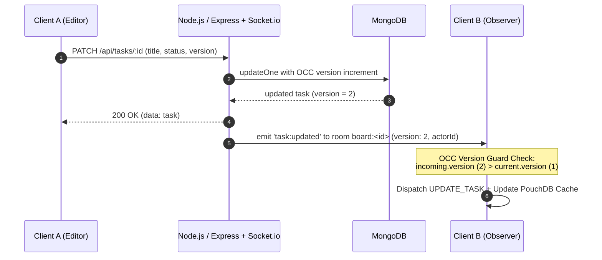

# Real-Time Task Synchronization & Optimistic Concurrency Control (OCC)

## Overview

CollabBoard integrates bi-directional real-time collaboration using **Socket.io** on top of its local-first PouchDB + REST API architecture. 

When collaborators make changes on any task (creating, editing, moving across status columns, or deleting), events are immediately broadcast to active board members with **Actor Attribution** (`actorId`) and **OCC Version Numbers** (`version`).

---

## Architecture Diagram



---

## Event Contracts

### 1. `task:created`
Broadcast when a collaborator creates a task.

```json
{
  "task": {
    "id": "6aa699fe8e0cdbb9c892c150",
    "title": "Implement OCC version guard",
    "boardId": "6aa699ed8bb67e7a06ccbcd9",
    "status": "todo",
    "priority": "high",
    "version": 1
  },
  "boardId": "6aa699ed8bb67e7a06ccbcd9",
  "actorId": "6aa699cf571e115cf7183762",
  "version": 1,
  "timestamp": "2026-09-13T12:40:00.000Z"
}
```

### 2. `task:updated`
Broadcast on title/description/priority updates or when moving tasks across columns (`moveStatus`).

```json
{
  "task": {
    "id": "6aa699fe8e0cdbb9c892c150",
    "title": "Implement OCC version guard",
    "boardId": "6aa699ed8bb67e7a06ccbcd9",
    "status": "in-progress",
    "priority": "urgent",
    "version": 2
  },
  "boardId": "6aa699ed8bb67e7a06ccbcd9",
  "actorId": "6aa699cf571e115cf7183762",
  "version": 2,
  "timestamp": "2026-09-13T12:40:05.000Z"
}
```

### 3. `task:deleted`
Broadcast when a task is deleted.

```json
{
  "taskId": "6aa699fe8e0cdbb9c892c150",
  "boardId": "6aa699ed8bb67e7a06ccbcd9",
  "actorId": "6aa699cf571e115cf7183762",
  "version": 2,
  "timestamp": "2026-09-13T12:40:10.000Z"
}
```

---

## OCC Version Guarding (Frontend)

In multi-user collaborative environments with network jitter, socket events can arrive out of order (e.g. packet for version 3 arrives before late packet for version 2).

The frontend prevents stale overwrites with the **OCC Version Guard**:

```typescript
// BoardContext.tsx
const unsubUpdated = subscribeTaskUpdated(async (payload) => {
  if (payload.boardId !== activeBoardId) return;

  const incoming = payload.task;
  const current = state.tasks.find((t) => t.id === incoming.id);

  // OCC Version Guard: Only accept if incoming version is strictly newer
  if (!current || Number(incoming.version || 1) > Number(current.version || 0)) {
    dispatch({ type: 'UPDATE_TASK', payload: incoming });
    await updateCachedTask(incoming);
  } else {
    console.warn(
      `[OCC Guard] Dropped stale/out-of-order task:updated event for task ${incoming.id}: incoming v${incoming.version} <= current v${current.version}`
    );
  }
});
```

---

## Room Management Lifecycle

- **Join:** When a user opens a board in `BoardView`, `joinBoardRoom(boardId)` is triggered.
- **Leave:** When navigating away or changing boards, `leaveBoardRoom(boardId)` is automatically triggered in cleanup hooks.
