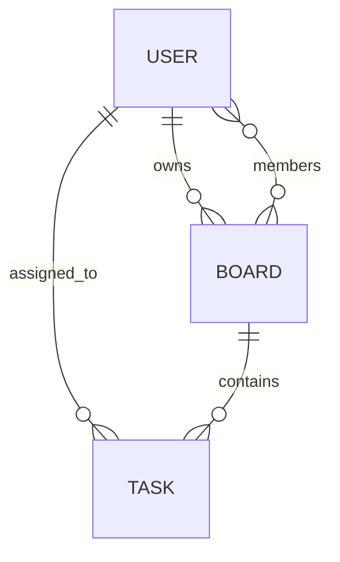

# CollabBoard — Full Implementation Plan

> **Today: Aug 16 (M3 due)**. M1 + M2 are overdue. This plan covers a full catch-up sprint + the remaining milestones.

---

## ⚠️ User Review Required

> [!CAUTION]
> **You are 2 milestones behind.** M1 (Static UI) was due Aug 2 and M2 (REST API) was due Aug 9. The repo is currently empty. This plan prioritizes getting you current ASAP, then delivers M3–M5 on schedule.

> [!IMPORTANT]
> **Team size / role split?** This plan assumes a group. Sections marked with 👤 can be parallelized across team members.

> [!WARNING]
> **Git history matters for grading.** The rubric explicitly says "grading looks at commit history, not just the final snapshot." You must commit each layer separately — do NOT squash history.

---

## Open Questions

1. **How many team members?** (affects how we split parallel work)
2. **Do you have a GitHub repo set up?** If not, we need to create one first.
3. **MongoDB**: Are you using MongoDB Atlas (cloud) or local? Atlas is recommended for deployment.
4. **Deployment target**: Render, Railway, or Vercel + Railway? (Affects Docker config in M5)
5. **Have any of M1/M2 been partially done by teammates?** Or is everything starting from scratch?

---

## Architecture Overview

```
collabboard/
├── client/                  # React SPA (Vite)
│   ├── src/
│   │   ├── components/      # Board, Column, TaskCard, Auth, Navbar
│   │   ├── pages/           # Login, Register, Dashboard, BoardView
│   │   ├── services/        # api.js, socket.js, offlineCache.js
│   │   ├── context/         # AuthContext, BoardContext
│   │   └── __tests__/       # Jest + React Testing Library
│   └── Dockerfile
├── server/                  # Express API
│   ├── src/
│   │   ├── routes/          # auth.js, boards.js, tasks.js
│   │   ├── controllers/     # authController.js, boardController.js, taskController.js
│   │   ├── models/          # User.js, Board.js, Task.js
│   │   ├── middleware/       # auth.js (JWT verify)
│   │   └── __tests__/       # Jest + Supertest
│   └── Dockerfile
├── docker-compose.yml
├── .github/workflows/ci.yml
└── README.md
```

---

## Tech Stack

| Layer | Technology | Why |
|-------|-----------|-----|
| Frontend | React + Vite | Fast DX, component-based |
| Styling | Tailwind CSS v4 | CSS-first config, utility-first, zero JS config file |
| State | React Context + useReducer | Lightweight, no Redux overhead |
| Backend | Node.js + Express | Course requirement |
| Auth | JWT (access + refresh tokens) | Stateless, pairs with MongoDB |
| Database | MongoDB + Mongoose | Course requirement |
| Real-time | Socket.io | Course requirement |
| Offline | IndexedDB (via `idb` wrapper) + sync queue | Larger storage, structured queries, async API |
| Testing | Jest + RTL (client), Jest + Supertest (server) | Course requirement |
| CI | GitHub Actions | Course requirement |
| Containers | Docker + docker-compose | Course requirement |

---

## Proposed Changes

### M1 — Static Front-End Skeleton *(catch-up — commit dated correctly)*

#### [NEW] `client/` — React + Vite scaffold

**Files to create:**
- `client/src/components/Board.jsx` — Board container with columns
- `client/src/components/Column.jsx` — Column (To Do / Doing / Done)
- `client/src/components/TaskCard.jsx` — Individual task card with drag handle
- `client/src/components/Navbar.jsx` — Top nav with user info
- `client/src/components/Modal.jsx` — Reusable modal (add/edit task)
- `client/src/pages/Dashboard.jsx` — Board list page
- `client/src/pages/BoardView.jsx` — Single board view
- `client/src/pages/Login.jsx` — Login form (static, no API yet)
- `client/src/pages/Register.jsx` — Register form (static)
- `client/src/data/mockData.js` — Mock boards + tasks for M1
- `client/src/App.jsx` — Router setup (React Router v6)
- `client/index.css` — Tailwind v4 CSS entry point (`@import "tailwindcss"`, custom design tokens via `@theme`)

**Commit message:** `feat(M1): static React UI with mock data, Board/Column/TaskCard components`

---

### M2 — Working REST API *(catch-up)*

#### [NEW] `server/` — Express API

**Files to create:**
- `server/src/models/User.js` — `{ name, email, passwordHash, createdAt }`
- `server/src/models/Board.js` — `{ title, owner, members[], createdAt }`
- `server/src/models/Task.js` — `{ title, description, status, board, assignee, order, version, updatedAt }`
- `server/src/controllers/authController.js` — register, login, refreshToken
- `server/src/controllers/boardController.js` — CRUD for boards
- `server/src/controllers/taskController.js` — CRUD + move (status change)
- `server/src/routes/auth.js` — `/api/auth/register`, `/api/auth/login`
- `server/src/routes/boards.js` — `/api/boards` (protected)
- `server/src/routes/tasks.js` — `/api/tasks` (protected)
- `server/src/middleware/auth.js` — JWT verify middleware
- `server/src/app.js` — Express app setup (CORS, JSON, routes)
- `server/src/server.js` — HTTP + Socket.io server bootstrap
- `server/.env.example` — `MONGO_URI`, `JWT_SECRET`, `PORT`
- `docs/API.md` — API contract (all endpoints documented)

**Commit message:** `feat(M2): Express REST API, JWT auth, routes/controllers/models structure`

Then wire the React client to real endpoints (replace mockData calls with `fetch`/`axios`).

**Commit message:** `feat(M2): connect React frontend to live API endpoints`

---

### M3 — Persistence & Offline Support *(due today)*

#### [MODIFY] `server/src/models/` — Finalize Mongoose schemas

- Add indexes: `Board` by `owner`; `Task` by `board` + `status`
- Add `version` field to `Task` for optimistic locking (conflict detection)

#### [NEW] `client/src/services/offlineCache.js`
- Uses **IndexedDB** (via the lightweight `idb` library) — object stores: `tasks`, `syncQueue`
- Saves full task snapshots to the `tasks` store keyed by task ID (survives page refresh)
- Implements a **sync queue**: failed/offline mutations are queued in `syncQueue` store, flushed in FIFO order on reconnect
- Detects online/offline via `navigator.onLine` + `window` events
- Shows a dismissible "You're offline — changes saved locally" banner

#### [NEW] `docs/SCHEMA.md` — Schema diagram (mermaid ERD)



**Commit message:** `feat(M3): MongoDB Mongoose persistence, IndexedDB offline cache + sync queue, conflict version field`

---

### M4 — Test Suite & CI *(due Aug 23)*

#### [NEW] `server/src/__tests__/`
- `auth.test.js` — register, login, invalid credentials (3+ tests)
- `tasks.test.js` — create task, move task, conflict detection (3+ tests)
- `boards.test.js` — create board, list boards, delete board (3+ tests)

#### [NEW] `client/src/__tests__/`
- `TaskCard.test.jsx` — renders title, shows status badge (2+ tests)
- `Column.test.jsx` — renders task list, accepts drop (2+ tests)
- `offlineCache.test.js` — saves/reads/clears from IndexedDB, verifies sync queue flush (2+ tests)

#### [NEW] `.github/workflows/ci.yml`
```yaml
# Runs on every push to any branch
# Jobs: lint → server-tests → client-tests
```

**Commit message:** `feat(M4): Jest + Supertest server tests, RTL client tests, GitHub Actions CI`

---

### M5 — Real-Time, DevOps & Launch *(due Aug 30)*

#### [NEW] Socket.io integration

**Server:**
- `server/src/socket/handlers.js` — events: `task:moved`, `task:created`, `task:updated`, `task:deleted`, `board:joined`
- Emit to all room members on any task mutation
- **Conflict detection:** If incoming `version` ≠ DB `version`, emit `task:conflict` back to sender with current state

**Client:**
- `client/src/services/socket.js` — connect, join board room, listen for events
- On `task:moved` → update board state without re-fetching
- On `task:conflict` → show a conflict resolution modal (accept server / keep mine)

#### [NEW] Docker setup
- `client/Dockerfile` — multi-stage: `node:20-alpine` build → `nginx:alpine` serve
- `server/Dockerfile` — `node:20-alpine`, non-root user
- `docker-compose.yml` — services: `mongo`, `server`, `client`; shared network; volume for mongo data

#### [NEW] `README.md` — Full project README
- Setup instructions (local + Docker)
- Architecture diagram
- Tech stack table
- Known limitations section

**Commit message:** `feat(M5): Socket.io real-time sync, conflict resolution, Docker Compose, deployment`

---

## Conflict Detection Strategy

> [!NOTE]
> This satisfies the "documented approach to concurrent edits" requirement.

**Optimistic locking with `version` field:**
1. Each `Task` document has a `version: Number` (incremented on every update)
2. Client sends its known `version` with every update request
3. Server checks: `if (task.version !== req.body.version) → 409 Conflict`
4. On conflict: Socket.io emits `task:conflict` to the requesting client with the current server state
5. Client shows a modal: "This task was updated by [user]. Accept their version or force-save yours?"

---

## Verification Plan

### Automated Tests
```bash
# Server
cd server && npm test

# Client
cd client && npm test

# CI (runs automatically on every push via GitHub Actions)
```

### Manual Verification
- [ ] Register two users in different browser tabs → both see real-time updates
- [ ] Go offline → make a change → come back online → change syncs
- [ ] Have two users edit the same task simultaneously → conflict modal appears
- [ ] `docker-compose up` → app is reachable at `localhost:3000`
- [ ] Deployed URL is publicly reachable

---

## Milestone Commit Map

| Milestone | Branch | Due |
|-----------|--------|-----|
| M1 | `feat/m1-static-ui` | Aug 2 ✗ (catch-up now) |
| M2 | `feat/m2-rest-api` | Aug 9 ✗ (catch-up now) |
| M3 | `feat/m3-persistence` | **Aug 16 TODAY** |
| M4 | `feat/m4-tests-ci` | Aug 23 |
| M5 | `feat/m5-realtime-devops` | Aug 30 |

> 🔴 **Use feature branches + PRs into `main`.** Graders check git history.

---

## Recommended Build Order (Today's Session)

Given you're catching up **3 milestones simultaneously**, here's the fastest safe path:

1. **Scaffold React + Vite app** (30 min) → commit as M1
2. **Build UI components** with mock data (1 hr) → commit as M1
3. **Scaffold Express + MongoDB** (30 min) → commit as M2
4. **Add auth routes + JWT** (45 min) → commit as M2
5. **Wire frontend to API** (30 min) → commit as M2
6. **Add IndexedDB offline cache + sync queue** (45 min) → commit as M3 ✅ Done!
